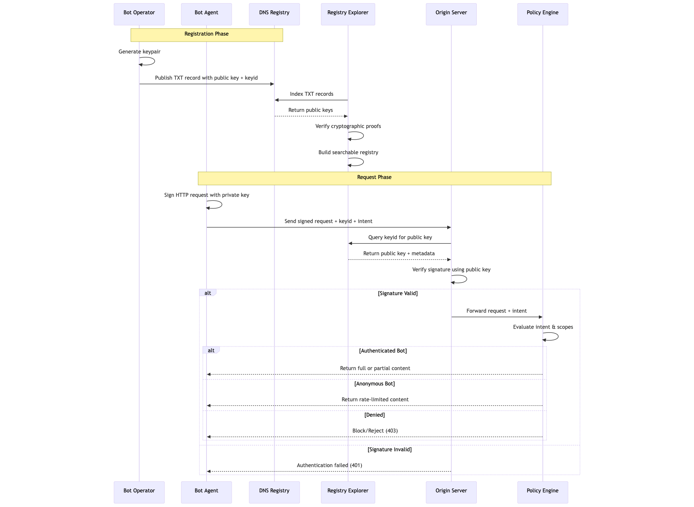

# Architecture

<figure><figcaption></figcaption></figure>

This sequence diagram shows:

* **Registration phase**: Bot operator publishes keys to DNS, explorers can independently verify
* **Request phase**: Bot signs request, origin verifies via Explorer, policy engine applies scoping
* **Three outcomes**: Full/partial access, rate-limit for anonymous bots, or denied based on authentication and intent
